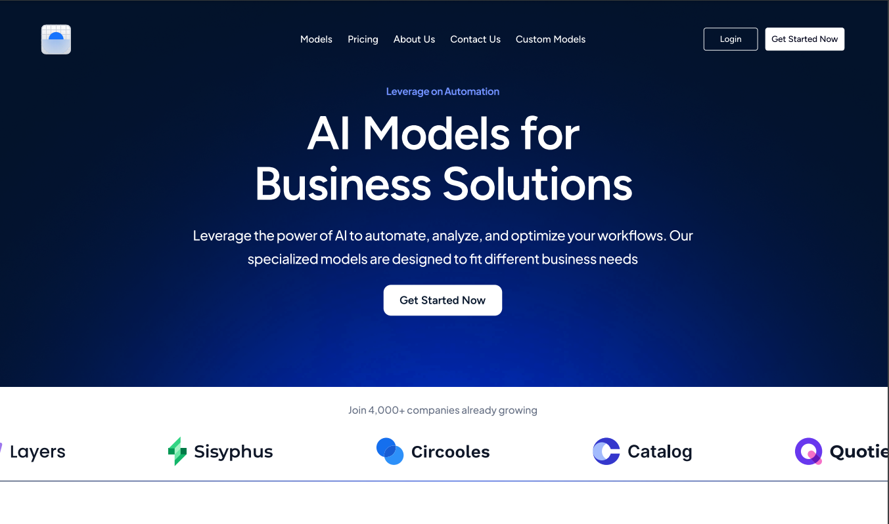

<p align="center">
  <a href="https://gidda.vercel.app" target="blank">
    
  </a>
</p>

# 🚀 Alpharithm - AI Business Portal

[](https://www.typescriptlang.org/docs/handbook/2/everyday-types.html)
[](https://react.dev/learn/start-a-new-react-project)
[](https://nextjs.org/docs/getting-started/installation)
[](https://docs.cypress.io/guides/overview/why-cypress)


## Setup

```sh
$ (ssh) git clone https://github.com/Raashot12/alpharithm-test.git
$ cd alpharithm-test
$ npm cache clean --force
$ npm install
# Or, npm install --legacy-peer-deps
# TODO copy .env credentials
$ npm run dev
```

#### Usage

> Local: http://localhost:3000

## Cypress Unit Testing

```sh
$ npm run cy:open
```

## Documentation

|   # | Service | URL                                                                                                                                           |
| --: | :------ | :-------------------------------------------------------------------------------------------------------------------------------------------- |
|   1 | Alpharithm   | https://gidda.vercel.app                                                                                                                      |
|   2 | Figma   | https://www.figma.com/design/jXjg4b5DsPMfX8jI4nOUZ4/Frontend-Engineering-Test?node-id=0-1&t=ZHVwPA90tL3aW7Dj-1                              |

## Screenshots




